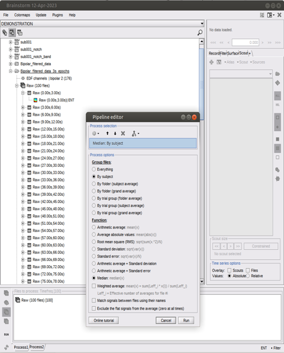
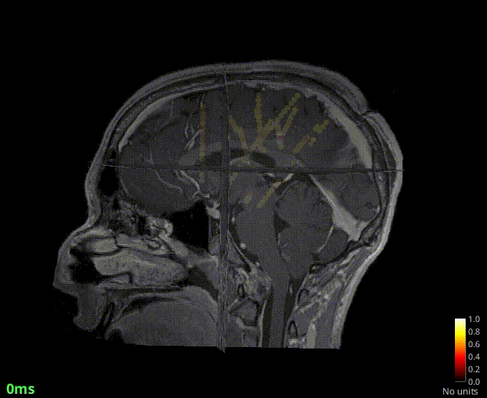

## IEEG Entropy
This Github page contains the Brainstorm process to compute Shannon Entropy values from the iEEG signal
## Bibtex
If you find our project is useful in your research, please cite Makaram et al. (2025):

``
Makaram N, Pesce M, Tsuboyama M, Bolton J, Harmon J, Papadelis C, Stone S, Pearl P, Rotenberg A, Grant EP, Tamilia E. Targeting interictal low-entropy zones during epilepsy surgery predicts successful outcomes in pediatric drug-resistant epilepsy. Epilepsia. 2025 Sep 20. doi: 10.1111/epi.18636. PMID: 40974546.
``
## Prerequisits
- Matlab
- Brainstorm toolbox

## Usage
Download the latest code from the github page and add it to your /$HOME/.brainstorm/process/ folder.
process_normalizedshannon_entropy.m 

# Steps to use it with brainstorm
<<<<<<< HEAD
1) Add the file "process_normalizedshannon_entropy.m" to you brainstorm process folder (hidden folder: /$HOME/.brainstorm/process/). Once this is done, you will find this function "process_normalizedshannon_entropy" in the list of "Entropy" function you can run through the Brainstorm process tab.
   
2) Now, in Brainstorm, preprocess your signal appropriately and import the epoch/s you want to extract entropy from (right-click on raw file, "Import in database"). If you are planning to replicate our work then import 3-second epochs, apply notch and bandpass filter (1 - 500 Hz) and apply bipolar montage.
   
3) Drag your signal/epochs into the brainstorm process tab and run the function from the "Entropy" tab (see image "Running Entropy Analysis").
4) Insert the type of channels you want to analyze (SEEG and/or ECOG). See image "Select appropriate channels"

5) This will generate an output file for each epoch which will be labeled with an "ENT". If you have multiple epochs, you can average their outputs through brainstorm (drag files in the process tab, then "Average files", see image "Averaged Entropy")
   
6) You can visualize the output entropy values as 2-D or 3D image, by right-click on the output file and click on "2D Electrodes" or "3D electrodes" (see images below)
   
7) To extract the entropy values to Matlab, right-click on the output file and "Export to Matlab". Entropy values will be in the "TF" field of the exported structure.
For the individual epoch outputs (not the averaged), you will also find a table (named "T_op") inside the exported structure which contains entropy values and corresponding electrode names.
   
**Running Entropy Analysis**

=======
1) Preprocess your signal appropriately and segment to epochs. If you are planning to replicate our work then apply notch and bandpass filter (1 - 500 Hz), apply bipolar montage and then import 3s epochs.

**Preprocessing the signal**

3) Once you open brainstorm you will find this code in the custom folder
4) Drag your signal/epochs into the brainstorm process tab and run the function from the custom code.
>>>>>>> d6535b2a954cfcdc1405d18d34e9e22de607c5e8

**Select appropriate channels**

<<<<<<< HEAD
=======
**Running the code**

4) This will generate a table inside the result_datafile (T_op) which can be exported to matlab and analysed. The generated output is also inside the result_datafile.TF
5) The function will return one file per epoch. Take the median/average using brainstorm function to obtain a single file

>>>>>>> d6535b2a954cfcdc1405d18d34e9e22de607c5e8
**Averaged Entropy**

**Representative Output**

**3D visualization**

